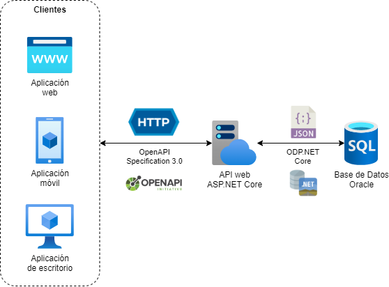

# Documentación

Bienvenido/a a la documentación del Proyecto RISK.

## Contenido
* [Arquitectura](#arquitectura)
* [Requerimientos](#requerimientos)
* [Instalación](#instalación)
* [Base de Datos](database/README.md)
* [Back-End](backend/README.md)

## Arquitectura
### General

### Mensajería

## Requerimientos
### Base de Datos
* [Oracle Database 12c o superior](https://www.oracle.com/database/technologies/xe-downloads.html)

### Back-End
* [.NET Core 3.1](https://dotnet.microsoft.com/download/dotnet-core/3.1)

Los servicios de mensajería tienen requerimientos especiales de terceros:

Servicio|Requerimiento
--------|-------------
Mail|Cuenta de Gmail configurada con autenticación [OAuth](https://github.com/jstedfast/MailKit/blob/master/GMailOAuth2.md) o acceso de [apps menos seguras](https://www.google.com/settings/security/lesssecureapps).
Push|Cuenta de Azure configurada con el servicio [Notification Hubs](https://azure.microsoft.com/es-es/services/notification-hubs/).
SMS|Cuenta de Twilio configurada con el servicio [SMS](https://www.twilio.com/sms).

## Instalación
### Base de Datos

Script|Descripción
------|-----------
compile_schema.sql|Compila objetos inválidos del esquema actual.
create_access_user.sql|Crea usuario y otorga permisos necesarios para llamar a los servicios del Proyecto RISK. Se debe ejecutar con SYS o SYSTEM.
create_code_user.sql|Crea usuario y otorga permisos necesarios para instalar los objetos de Base de Datos del Proyecto RISK. Se debe ejecutar con SYS o SYSTEM.
generate_docs.sql|Genera archivos de documentación de objetos de Base de Datos con la herramienta *plsqldoc*. Se debe ejecutar desde un Command Window de PL/SQL Developer con el plug-in *plsqldoc* instalado.
install.sql|Instala en el esquema actual los objetos de Base de Datos del Proyecto RISK.
install_audit.sql|Genera campos y triggers de auditoría.
install_dependencies.sql|Instala en el esquema actual las dependencias de terceros (Ver [Dependencias](database/README.md#dependencias)).
uninstall.sql|Desinstala del esquema actual los objetos de Base de Datos del Proyecto RISK.
uninstall_dependencies.sql|Desinstala del esquema actual las dependencias de terceros.

### Back-End
#### Pasos para configurar el entorno de desarrollo
1. Instalar el SDK de .NET Core 3.1 siguiendo las instrucciones según la plataforma preferida.
2. Opcionalmente, instalar el editor Visual Studio Code con la extensión C#.
3. Clonar o descargar el repositorio de RISK.
4. En el command prompt, ubicarse en la raíz del repositorio e ir hasta *source/backend/Risk.API* (contiene el archivo del proyecto *Risk.API.csproj*).
5. Realizar las configuraciones necesarias en los archivos *appsettings.json* y *config/log/nlog.config*.
6. Ejecutar el comando: `dotnet run`.