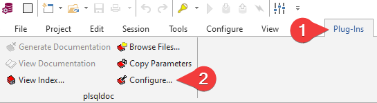
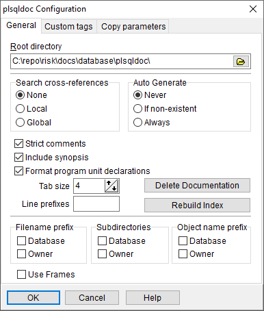

# Base de Datos

## Contenido
* [API PL/SQL](plsqldoc/index.html)
* [Guía de estilo para Desarrollo](styleguide.md)
* [Dependencias](#dependencias)
* [Configuración de PL/SQL Documentation (plsqldoc)](#configuraci%C3%B3n-de-plsql-documentation-plsqldoc)

## Dependencias

Dependencia|Descripción|Fuente
-----------|-----------|------
as_pdf3|Genera archivos en formato PDF|https://technology.amis.nl/2012/04/11/generating-a-pdf-document-with-some-plsql-as_pdf_mini-as_pdf3/
as_xlsx|Genera archivos en formato XLSX|https://technology.amis.nl/2011/02/19/create-an-excel-file-with-plsql/
as_zip|Comprime y descomprime archivos en formato ZIP|https://technology.amis.nl/2010/03/13/utl_compress-gzip-and-zlib/
csv|Genera archivos en formato CSV|https://oracle-base.com/dba/script?category=miscellaneous&file=csv.sql
oos_util_totp|Genera y valida códigos con el algoritmo TOTP|https://github.com/OraOpenSource/oos-utils
zt_qr|Genera códigos QR|https://github.com/zorantica/plsql-qr-code
zt_word|Genera archivos en formato DOCX|https://github.com/zorantica/plsql-word

## Configuración de PL/SQL Documentation (plsqldoc)

Para configurar el Plug-In PL/SQL Documentation (plsqldoc) en PL/SQL Developer seguir estos pasos:

1. Ir al menú *Plug-Ins* y en el apartado *plsqldoc* dar click en *Configure...*

2. Usar la siguiente configuración:

